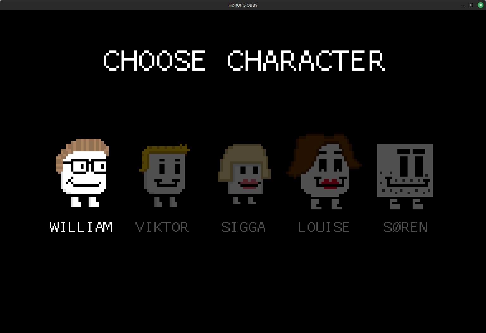
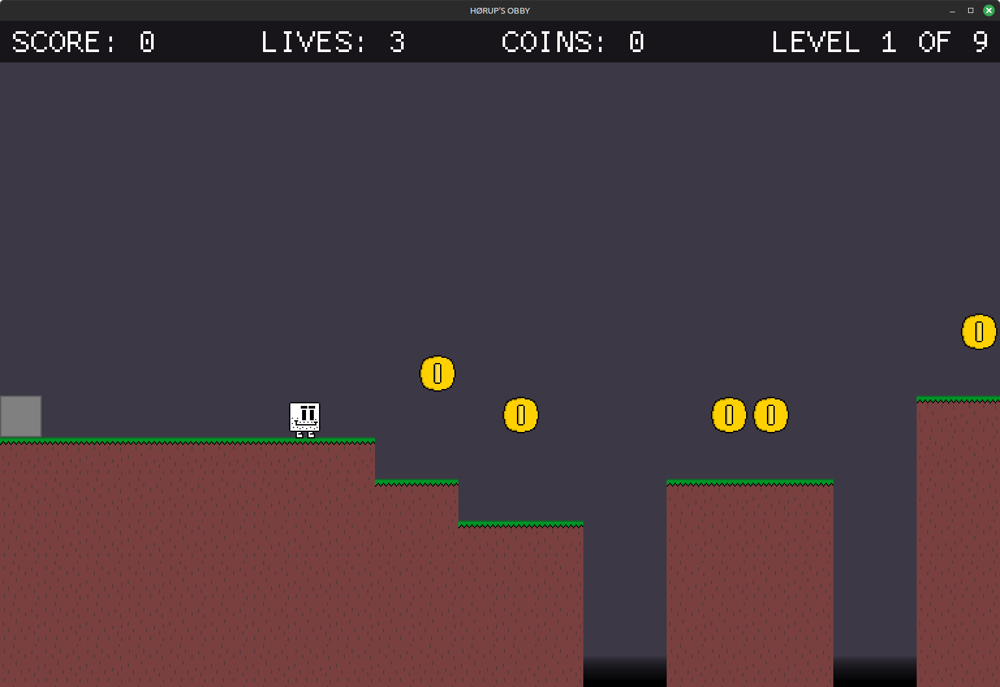

# HØRUP'S OBBY
A 2D platformer written in `Rust` using `Macroquad` and `Tiled`.

The game is inspired by the "Obby experiences" on Roblox.

Consists of the following:

`cliplib` provides the clip_move function that allows moving of bodies.

`game` provides the 'gameplay' experiences, i.e. implements the meat of the game.

`obby` implements the gameloop using `Macroquad` and takes care of drawing, sound playing and loading resources. Also implements the UI and "App Logic". 

`res` holds all the assets, such as maps, images, sounds, etc. 

